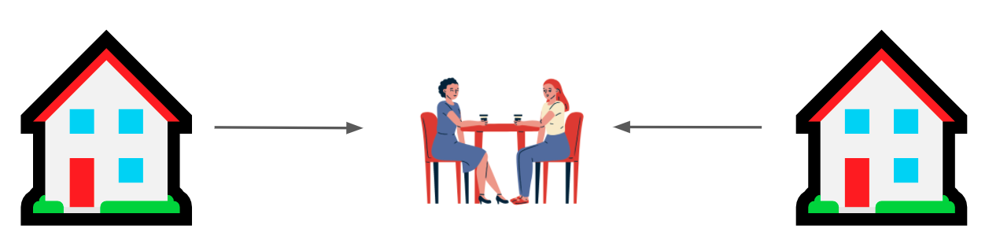
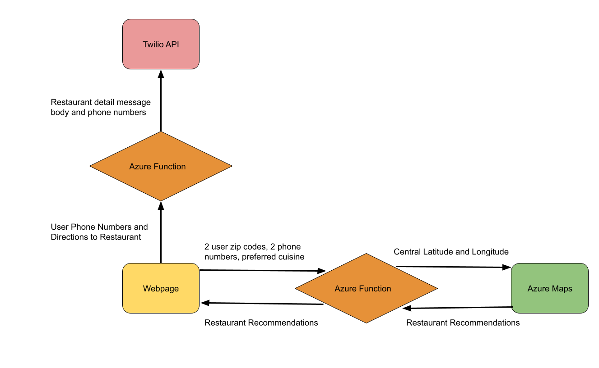

# Dine the Distance

### Find restaurant options halfway between you and a friend!



### About Me 👩‍💻

Hi! My name is Anita, and I'm currently a junior studying Computer Science at the University of Illinois at Chicago. When I'm not doing school work, my favorite hobbies include biking, cooking, and painting (I've been doing a lot of online paint alongs during lockdown).


​I'm a HUGE foodie. One of my favorite social activities has always been going out to eat with friends. I thoroughly miss in-person classes in Chicago because it gave me an excuse to try out new places for takeout nearly every week. If you're ever in the city, I 10/10 recommend heading to [Brightwok Kitchen](https://brightwok.com/)!

**Choosing a place to eat has always been a struggle of mine**, and there are a couple factors I always take into account:

1.  **Convenience** – I have never been one to take a road trip just for the sake of getting some food.
2.  **Cuisine** – I crave Sushi way more often than I would like to admit.

That's pretty much it. I'm generally not that picky 😊

### What's Dine the Distance? 🚗

​ **Dine the Distance is a web application that takes the zip location locations between two points (you and a friend), a restaurant cuisine, and delivers restaurant recommendations at a neutral midpoint location**. Each restaurant recommendation is requested from the Azure Maps API and includes a link to the location’s website, menu, phone number, and address. Dine the Distance provides food locations that are convenient whilst filtering results by cuisine preferences. It was created to help avoid situations where you and your friends cannot decide on a place to meet up and grab something to eat.



Now let's go into the steps I took to build this project, so you can replicate it:

### Creating the Azure Function App 💻

1. Navigate to the Azure Portal and **create a Function App** Resource that uses a **Node.js runtime stack**.
2. After it has deployed, **add an HTTP trigger** to your resource. This is where we will be providing the backend code for our application!
3. Before the function can be used, you will want to **install the necessary package dependencies**. Run “**npm init -y**” in your terminal to create a package.json file to store your dependencies. Next, install the following dependencies (npm install):
   - **node-fetch**
     - To make our HTTP requests
     - https://www.npmjs.com/package/node-fetch#api
   - **us-zips**
     - To convert user zip code input into latitude and longitude coordinates
     - https://www.npmjs.com/package/us-zips
   - **geolib**
     - To find the midpoint between two coordinate locations
     - https://www.npmjs.com/package/geolib

### Frontend ✨

### 1. Create a form for user input

```html
<form onsubmit="handle(event)" enctype="multipart/form-data">
  <div class="row">
    <div class="form-group col-md-6">
      <input type="text" name="zip1" placeholder="Zip Code 1" required />
      <input type="text" name="phone1" placeholder="Phone Number 1" required />
    </div>

    <div class="form-group col-md-6 mt-3 mt-md-0">
      <input type="text" name="zip2" placeholder="Zip Code 2" required />
      <input type="text" name="phone2" placeholder="Phone Number 2" required />
    </div>
  </div>

  <div class="text-center" style="padding-top: 30px;">
    <input type="text" name="cuisine" placeholder="Food Cuisine" required />
  </div>
  <div class="text-center"><button type="submit">Find Food!</button></div>
</form>
```

​To capture the user’s location, contact information, and preferred cuisine information, you will need to **create a form in an index.html file**. The main elements you will definitely need in this form include:

- Two inputs for two user zip code locations
- Two inputs for two user phone numbers
- A submit button to send the form data to our HTTP trigger (called dineTrigger)

### 2. Send user's form data to our HTTP trigger (dineTrigger)

```javascript
var functionUrl = "/api/dineTrigger";
const resp = await fetch(functionUrl, {
  method: "POST",
  body: JSON.stringify({ zip1, zip2, cuisine }),
  headers: {
    "Content-Type": "application/json",
  },
});

var data = await resp.json();
var newData = JSON.stringify(data.results);
var obj = JSON.parse(newData);
```

​ **Create a JavaScript file** (mine is called main.js) in order to send an object containing the user zip code and cuisine information ({zip1, zip2, cuisine}) utilizing a [POST](https://developer.mozilla.org/en-US/docs/Web/HTTP/Methods/POST) request. Next, [await](https://developer.mozilla.org/en-US/docs/Web/JavaScript/Reference/Operators/await) a JSON response body from the dineTrigger function (that will return restaurant information) that can be [parsed](https://developer.mozilla.org/en-US/docs/Web/JavaScript/Reference/Global_Objects/JSON/parse) to populate the frontend. Whenever we receive data from a web server it is always a string, so by using **JSON.parse** we can turn this data into a Javascript object which will be much easier to work with when we want to access our restaurant data.

### Backend ⚙️

### `HTTP Trigger 1 (dineTrigger)`

Our first HTTP trigger will **send our user zip code and cuisine information to Azure Maps** to retrieve restaurant information.
The following code snippets will need to go into the index.js file of our HTTP dineTrigger function.

### 1. Convert zip codes into coordinates and find the midpoint

```javascript
module.exports = async function (context, req) {
  var body = req.body;

  //zip code 1 -> latitude and longitude (us-zips) -> zip1Response
  //zip code 2 -> latitude and longitude (us-zips) -> zip2Response
  // midpoint lat lon (geolib) -> centerCoords

  var zip1 = body.zip1;
  var zip2 = body.zip2;

  var zip1Response = usZips[zip1];
  var zip2Response = usZips[zip2];

  var centerCoords = geolib.getCenterOfBounds([
    {
      latitude: zip1Response["latitude"],
      longitude: zip1Response["longitude"],
    },
    {
      latitude: zip2Response["latitude"],
      longitude: zip2Response["longitude"],
    },
  ]);

  var cuisine = body.cuisine;

  var testResult = await analyzeCoords(
    centerCoords["latitude"],
    centerCoords["longitude"],
    cuisine
  );

  context.res = {
    // status: 200, /* Defaults to 200 */
    body: testResult,
  };
};
```

​Before we can request restaurant data, we will need to **find the midpoint between the two zip code locations** entered by the user. This is where the us-zips and geolib node packages come in handy! First, **convert the user zip code locations into JSON objects** with their respective latitude/longitude coordinates using the usZips function.
If we ran the usZips function on zip code '54301', the JSON object would look something like:

```javascript
// Shape
{
    '54301': {
        latitude: 44.480778,
        longitude: -88.016063
    }
}
```

Next, we will use the coordinates we've just retrieved from usZips to find the midpoint via geolib.getCenterOfBounds. The getCenterOfBounds function takes in an array of coordinates and returns an object containing the central latitude and longitude:

```javascript
// Shape
{
    "latitude": centerLat,
    "longitude": centerLon
}
```

Now that we've calculated the midpoint, the last step is to pass in the center latitude, center longitude, and preferred user cuisine into another function (analyzeCoords), which we will use to send this data to the Azure Maps API for restaurant recommendations.

### 2. Request Restaurant Data

```javascript
async function analyzeCoords(latitude, longitude, cuisine) {
  const subscriptionKey = process.env["map-key"];
  const uriBase = "https://atlas.microsoft.com" + "/search/fuzzy/json";

  let params = new URLSearchParams({
    "api-version": "1.0",
    query: cuisine + " " + "restaurant",
    "subscription-key": subscriptionKey,
    lat: latitude,
    lon: longitude,
    limit: 10,
  });

  let resp = await fetch(uriBase + "?" + params.toString(), {
    method: "GET",
  });

  let data = await resp.json();

  return data;
}
```

​Let us take a closer look at the **analyzeCoords (latitude, longitude, cuisine)** function. In this function, you will want to populate your URL search parameters to specify the exact data we want. In my code, I specify that I want a restaurant with the user specified cuisine located near the central latitude and longitude. Lastly, I specify that I only want Azure Maps to give me back 10 restaurant results (limit). After creating the parameters, you'll want to perform a [GET](https://developer.mozilla.org/en-US/docs/Web/HTTP/Methods/GET) request for your response data.

Refer to the Free Form Search API documentation to add or modify URL parameters as you see fit:

https://docs.microsoft.com/en-us/rest/api/maps/search/getsearchfuzzy

### `HTTP Trigger 2 (msgTrigger)`

Our second HTTP trigger will **send users text message directions** with information about the restaurant they select.

### 1. Add Twilio Bindings to msgTrigger's function.json file

```
{
  "type": "twilioSms",
  "name": "message",
  "accountSidSetting": "TwilioAccountSid",
  "authTokenSetting": "TwilioAuthToken",
  "from": "+1425XXXXXXX",
  "direction": "out",
  "body": "Azure Functions Testing"
}
```

​ You'll need to [create a Twilio Account](https://www.twilio.com/try-twilio) in order to populate your [Twilio resource binding](https://docs.microsoft.com/en-us/azure/azure-functions/functions-bindings-twilio?tabs=javascript) with the proper **accountSID, authToken, and Twilio phone number** for validation purposes. In this project, I created two bindings in order to send a separate text to each of the two user's who will need the restaurant address. I named the first binding "message" and the second binding "message2" (_SUPER_ original names, I know).

### 2. Send user's restaurant choice to the HTTP trigger (msgTrigger)

```javascript
async function sendAddress(phone1, phone2, address, name) {
  var functionUrl = "/api/msgTrigger";
  const resp = await fetch(functionUrl, {
    method: "POST",
    body: JSON.stringify({ phone1, phone2, address, name }),
    headers: {
      "Content-Type": "application/json",
    },
  });
}
```

​Similar to how we sent an object containing form information to dineTrigger, we'll need to make **another POST request in our main.js file** to send an object containing the user's phone numbers and restaurant location ({phone1, phone2, address, name}) to our new HTTP trigger.

### 3. Text both users the address of the restaurant they select

```javascript
module.exports = async function (context, req) {
  var body = req.body;
  var phone1 = body.phone1;
  var phone2 = body.phone2;
  var address = body.address;
  var restaurantName = body.name;

  var txtMessage =
    "Thanks for using Dine the Distance! Here's the address to go to " +
    restaurantName +
    ": " +
    address;

  //send directions

  context.bindings.message = {
    body: txtMessage,
    to: phone1,
  };
  context.bindings.message2 = {
    body: txtMessage,
    to: phone2,
  };
};
```

​Finally! It's time to **send the users the address of the restaurant they plan to go** to inside of msgTrigger's index.js file. After defining the body of the received POST request, we can formulate our message into a variable (txtMessage) and specify the body and phone numbers we want to contact in context.bindings.message.

### Deploying the Static Web App 🚀

1.  [Create a static web app](https://docs.microsoft.com/en-us/azure/static-web-apps/getting-started?tabs=vanilla-javascript) in the Azure Portal and add the workflow to the master branch of the GitHub repo you are currently working in
2.  Grab a friend and try a new restaurant with Dine the Distance!

Here's a link to try out my version: https://calm-moss-0d1a6c110.azurestaticapps.net/ \
Additionally, feel free to take a look at my [Github repo](https://github.com/a-padman/Dine2)!

### So what's next? 🔮

​Dine the Distance has some room for additional features. The next course of action involves presenting each user with a distance tracker to help them visualize how far they will need to drive to each recommended restaurant.

Until then....with Dine the Distance, you and your friends can stop aimlessly scrolling on online for restaurants nearby and instead utilize this all-in-one functional web app next time you want to grab a bite!

### Special Mentions 🤗

​This project was created as part of the [Bit Project](https://bitproject.org/course/serverless) Serverless BitCamp cohosted by Microsoft. I'd like to thank my mentor Marie Hoeger for answering all my questions and making this project a great learning experience! Additionally, thanks to Emily, Evelyn, and Julia for coordinating our cohort activities and laying out clear expectations throughout the Bit Camp.

Lastly, the name credit for this app goes out to my dear friend Divya Francis 💖
